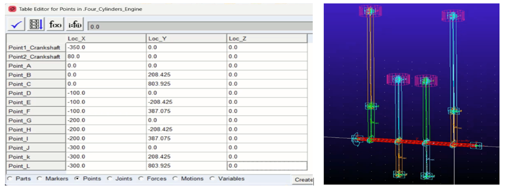

# Four Cylinder Inline Engine Dynamics Simulation using ADAMS/View

## Overview

This repository contains the modelling, analytical calculations and ADAMS/View validation of a **four-cylinder inline engine slider-crank mechanism**.

The project focuses on studying engine kinematics, dynamics and inertia effects through analytical modelling and multibody simulation. The analytical results are validated against an **ADAMS/View mechanical simulation model**.

The engine operates at:

- **Engine speed:** 3000 RPM
- **Configuration:** Inline four-cylinder engine
- **Mechanism:** Slider-crank mechanism
- **Simulation platform:** MSC ADAMS/View

---

# Project Objectives

The main objectives of this project are:

- Develop a mathematical model of a four-cylinder inline engine mechanism
- Analyse piston and connecting rod motion
- Calculate velocity and acceleration characteristics
- Evaluate inertia forces and torque variations
- Build and validate the mechanism using ADAMS/View
- Compare analytical results with multibody simulation outputs

---

# Repository Structure

---

# Engine Model Setup

The engine model consists of:

- Four piston-cylinder assemblies
- Crankshaft mechanism
- Connecting rods
- Slider-crank kinematic joints
- Defined markers and reference points
- ADAMS/View multibody simulation environment

The geometry was created using defined locations and constraints to represent the inline-four engine configuration.

---

# Kinematic Analysis

The analytical model evaluates:

## Piston Motion

Calculated parameters:

- Piston displacement
- Linear velocity
- Linear acceleration

## Connecting Rod Motion

Calculated parameters:

- Angular velocity
- Angular acceleration

The results describe the complete motion behaviour over two crank revolutions.

---

# Dynamic Analysis

The dynamic analysis includes:

- Primary inertia forces
- Secondary inertia forces
- Applied torque variation
- Input power fluctuations

These calculations demonstrate the effect of reciprocating masses on engine dynamics.

---

# ADAMS/View Validation

The analytical results were validated using MSC ADAMS/View simulation.

The ADAMS model provides:

- Piston displacement verification
- Velocity comparison
- Acceleration comparison
- Connecting rod motion analysis
- Multibody dynamic response

Provided in figures directory

---

# Results

The repository contains generated figures for:

### Kinematic Results

- Piston displacement vs crank angle
- Piston velocity vs crank angle
- Piston acceleration vs crank angle
- Connecting rod angular velocity
- Connecting rod angular acceleration

### Dynamic Results

- Primary and secondary unbalanced forces
- Inertia torque
- Input power variation

### ADAMS Simulation Results

- Position response
- Velocity response
- Acceleration response
- Angular motion validation

All figures are available in the `figures` directory.

---

# Tools Used

| Tool | Purpose |
|---|---|
| MSC ADAMS/View | Multibody dynamics simulation |
| MATLAB/Python | Analytical calculations and plotting |
| CAD/Geometry definition | Engine mechanism setup |

---

# Key Learning Outcomes

- Understanding of slider-crank mechanism dynamics
- Relationship between crank angle and piston motion
- Effect of reciprocating mass on engine vibration
- Multibody simulation workflow using ADAMS/View
- Validation of analytical models using simulation tools

---

# Author

**Muhammad Wasib**

MSc Automotive Engineering  
Birmingham City University

---
